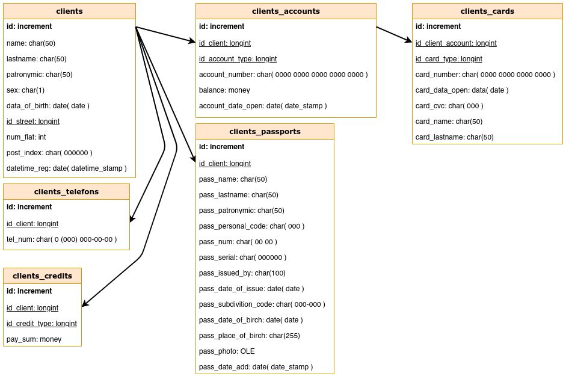
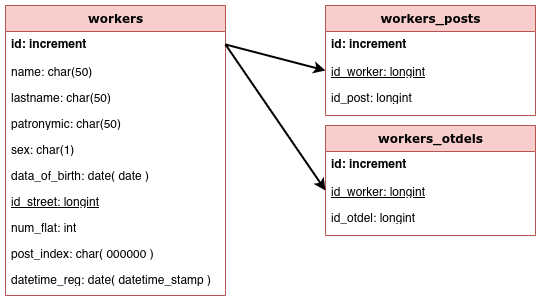
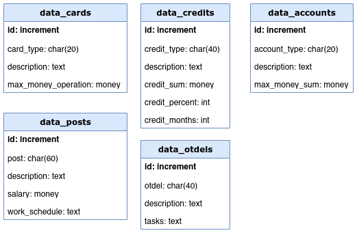
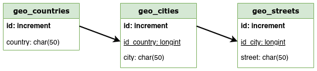
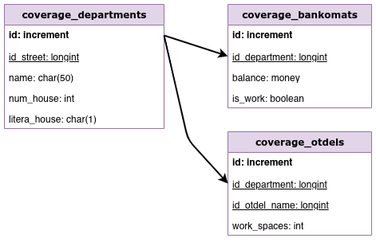
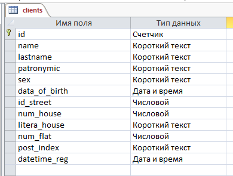
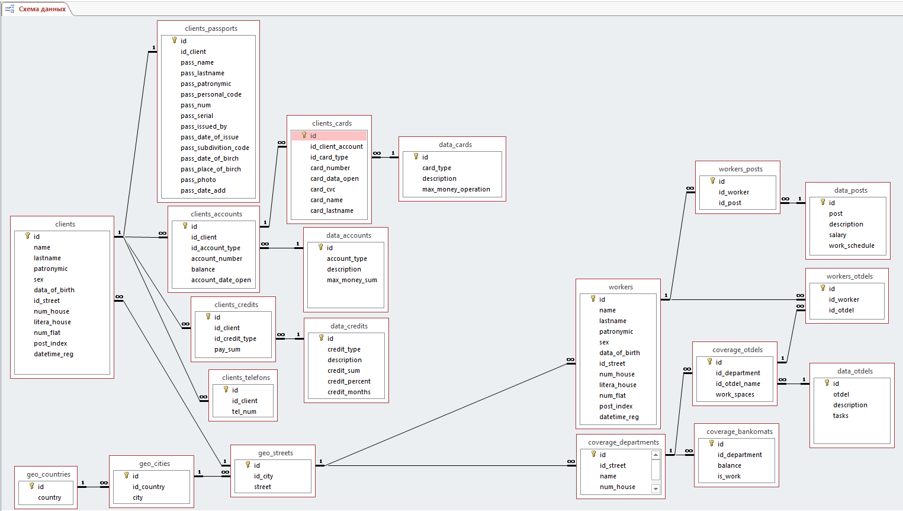
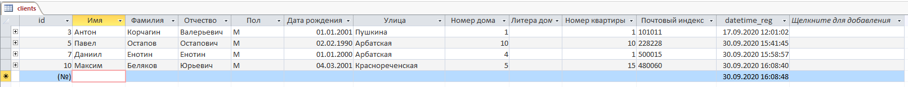
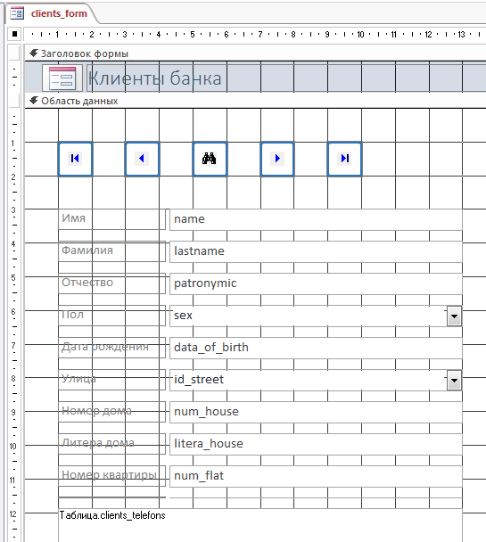
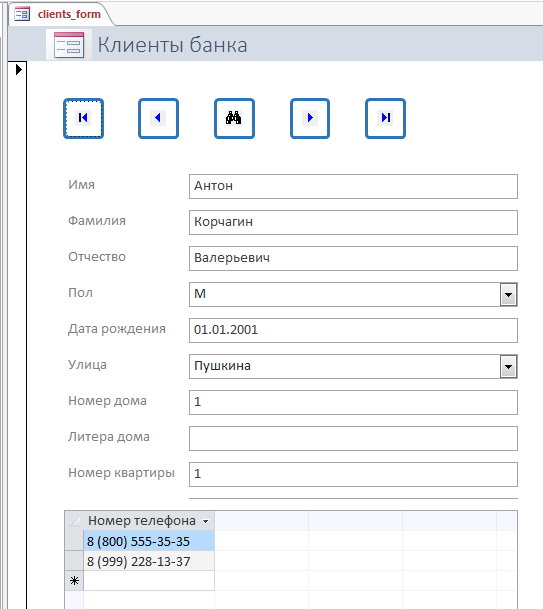

## Титульный лист

## Cодержание

## Введение

Тема курсовой работы: автоматизация работы банка

Цель курсовой работы: создание ИС на основе СУБД Access для автоматизации, ускорения и упрощения выполнения банковских задач

Задачи курсовой работы:

1. Хранение, изменение и получение всевозможных данных о клиентах и сотрудниках банка и предоставляемых услугах.
2. Обеспечение защиты, сохранности и целостности данных.
3. Итоговое представление данных в удобочитаемом виде.
4. Возможность изменения данных в любой момент.
5. Обеспечение невозможности поломки данных при использовании ИС по назначению.
6. Обеспечение корректного хранения и преобразования данных особых форматов.
7. Возможность использования базы данных по прямому назначения.
8. Возможность для дальнейшего расширения базы данных.
9. Создание простого, но функционального интерфейса из форм для работы с подсистемой хранения.

Части пояснительной записки:

1. Теоретическая. В данной части производится описание используемых технических терминов и понятей, используемых типов данных и SQL-запросов.
2. Практическая. В данной части описывается ход анализа, разработки и создания базы данных.

## 1 Теоретическая часть

### 1.1 Основные термины и понятия баз данных

1. База данных ( БД ) - это совокупность специальным образом организованных данных, хранимых в памяти вычислительной системы. При этом данные должны быть непротиворечивы, минимально избыточны и целостны.
2. Система управления базами данных ( СУБД ) - совокупность программных и лингвистических средств общего или специального назначения, обеспечивающих управление созданием и использованием баз данных.
3. Модели баз данных - описания содержания, структуры и ограничений целостности, используемые для создания и поддержки базы данных. Выделяют следующие основные модели баз данных:
	1. Реляционная - несколько взаимосвязанных между собой двумерных таблиц, наиболее распространённая модель БД.
	2. Постреляционная - расширенная реляционная модель, снимающая ограничение неделимости данных, хранящихся в записях таблиц, с помощью многозначных полей, т.е. полей, значения которых состоят из подзначений. Проще говоря таблица в таблице.
	3. Сетевая - все данные связаны со всеми. Такая модель обычно делится на уровни, так, чтобы протоколы вышестоящего уровня использовали бы протоколы нижестоящего уровня.
	4. Документно-ориентированная - хранение данных в виде коллекций документов. Обычно в формате JSON.
	5. Иерархическая - представление базы данных в виде древовидной структуры, состоящей из объектов различных уровней.
4. Реляционная база данных - база данных, основанная на реляционной модели данных. Она представляет связанную между собой совокупность таблиц - сущностей базы данных. Основу реляционной БД составлют следующие элементы:
	1. Таблица - это совокупность связанных данных, хранящихся в структурированном виде в базе данных. Она состоит из столбцов и строк. Таблица содержит определенное число столбцов, но может иметь любое количество строк.
	2. Поля - это столбцы таблицы в реляционной БД. Они отвечают за какие-либо характеристики объекта и содержат значения данного свойства.
	3. Записи - это строки таблицы в реляционной БД. Они отвечают за собственно объекты, хранимые в БД, и содержат набор значений свойств, размещенных в полях базы данных. Каждая запись однозначно определяется одним или несколькими уникальными значениями.
	4. Связь - отношение подчиненности, которое определяет, что для каждой записи главной таблицы может существовать одна или несколько записей во внешней таблице. Выделяют следующие виды связей:
		1. Ключевое поле ( первичный ключ ) - это поле, значения которого однозначно определяют записи в таблице и являются уникальными в пределах данной таблицы. Служит как ограничение целостности.
		2. Внешний ключ ( вторичный ключ ) - поле связи дочерней таблицы, является ограничением целостности - дочерняя таблица не может ссылаться на несуществующие записи главной таблицы.
		3. Связь один-к-одному ( 1:1 ) - к одному главной первой таблицы соответствует только один атрибут внешней таблицы и наоборот.
		4. Связь один-ко-многим ( 1:М ) - к одному атрибуту главной таблицы соответствует несколько атрибутов внешней таблицы.
		5. Связь многие-ко-многим ( М:М ) - к одному атрибуту главной таблицы соответствует несколько атрибутов внешней таблицы и наоборот.
	5. Индекс - объект базы данных, создаваемый с целью повышения производительности поиска данных. При этом индексы замедляются процессы вставки и удаления данных, т.к. они должны производить перерасчёт индексов.
	6. Данные - формы представления информации, с которыми имеют дело информационные системы и их пользователи.
5. Microsoft Access - Реляционная система управления базами данных ( СУБД ) корпорации Microsoft. Входит в состав пакета Microsoft Office. Имеет широкий спектр функций, включая связанные запросы, связь с внешними таблицами и базами данных. Благодаря встроенному языку VBA, в самом Access можно писать приложения, работающие с базами данных.
6. Visual Basic for Applications ( VBA ) - немного упрощённая реализация языка программирования Visual Basic, встроенная в линейку продуктов Microsoft Office.

### 1.2 Нормализация баз данных

Нормализация базы данных ( нормализация ) - процесс преобразования реляционной базы данных к виду, отвечающему нормальной форме. Проще говоря, это процесс организации данных в базе данных. Нормализация позволяет избежать различных ошибок при проектировании баз данных, которые могут привести к ошибкам, избыточности ( лишним, бесполезным или дублированным, повторяющимся данным ), нарушению целостности, аномалиям добавлений, обновлений, удалений, а также помешать расширению и развитию базы данных в дальнейшем. Обычно данные преобразования производятся с помощью декомпозиции, т.е. разбивания данных на атомарные ( неделимые ), первичные ( невыводимые, исходные ) значения. Несмотря на то, что нормализация баз данных является по сути рекомендацией для разработчиков, её принципов лучше придерживаться, так они позволяют сразу создать правильную модель базы данных.

Нормальная форма ( НФ ) -  совокупность требований и рекомендаций, предъявляемых к структуре таблиц реляционной базы данных, для устранения из базы избыточных зависимостей полями таблиц. При этом каждая последующая нормальная форма требует выполнения также и предыдущих, если они есть. Также, к базовой и обычно достаточной нормализации относят первые три НФ, остальные же являются более затратными и даже не всегда полностью выполнимыми, и выполняются в зависимости от заданной задачи.

Возможные нормальные формы:

1. 1 НФ ( первая НФ ) - таблица находится в 1 НФ, если все значения данных в её полях являются атомарными. Т.е. если в каждой ячейке таблицы содержится одно и только одно значение. Если это не так, то необходимо разделить значения из одной строки на несколько, даже если они будут повторяться. 
2. 2 НФ ( вторая НФ ) - таблица находится во 2 НФ, если она уже соответствует 1 НФ, и каждое не ключевое поле зависит только от ключевого поля . Т.е. если значения в каждом поле не повторяются, за исключением внешних ключей и нет подмножеств данных, что можно вынести в отдельную таблицу. В противном случае необходимо выявить повторяющиеся данные и переместить их в отдельную таблицу, а затем объединить их с помощью ключей.
3. 3 НФ ( третья НФ ) - таблица находится в 3 НФ, если она уже соответствует 2 НФ, и каждое не ключевое поле логически зависит от таблицы и ключевого поля. Т.е. если какое-либо поле в базе данных может быть связанно более с чем одной таблицей, оно должно быть вынесено, а остальные поля должны зависить лишь от своей таблицы.

### 1.3 Типы данных в СУБД Access

Все данные в Access хранятся в виде заранее определённых типов и форматов данных, которые указываются при таблицах:

1. Короткий текст - поле для короткого текста ( указывается до 255 символов ). Если введённых данных меньше длины поля, остатки заполняются пробелами. Обычно этот тип используется для хранения нескольких слов или данных особого формата. Не имеет заранеее определённых форматов, но поддерживает маски хранения и ввода.
2. Длинный текст / поле MEMO - поля для большого текста ( до 65535 символов при ручном вводе, или до 2ГБ текста при автозаполнении ( 2 байта на знак ) ). Не имеет форматов, по сути являсь обычным текстом.
3. Числовой - поле для хранения числовых значений. Подразделяется на несколько форматов:
	1. Байт ( 1 байт / 0 - 255 ).
	2. Целое ( 2 байта / -32 768 - 32 767 ).
	3. Длинное целое ( 4 байта / -2 147 483 648 - 2 147 483 647 ).
	4. Одинарное с плавающей точкой ( 4 байта / -3.4e38 - 3.4e3.8 / точность - 7 знаков ).
	5. Двойное с плавающей точкой ( 8 байт / -1.797e308 - 1.797e308 / точность - 15 знаков ).
	6. Действительное ( 12 байт / точность - 28 знаков ).
	7. Код репликации ( 16 байт ) - число в 16-тиричной системе счисления, формата {00000000-0000-0000-0000-000000000000}.
4. Дата и время - поля для хранения временных значений. Имеет несколько форматов:
	1. Полный формат даты ( dd.MM.yyyy hh:mm:ss ).
	2. Длинный формат даты ( dd month yyyy г. ).
	3. Средний формат даты ( dd-mon-yyyy ).
	4. Краткий формат даты ( dd.MM.yyyy ).
	5. Длинный формат времени ( hh:mm:ss ).
	6. Средний формат времени ( h:mm ).
	7. Краткий формат времени ( hh:mm ).
5. Денежный - поле для хранение денежных или нестандартных числовых значений. По сути явлется обычным числом, но никогда не округляется при вычислениях. Обладает следующими форматами:
	1. Основной ( 1000,000 ) - обычный числовой формат.
	2. Денежный ( 1 000,00 Р ) - денежный формат в рублях.
	3. Евро ( 1 000,00 E ) - денежный формат в евро.
	4. Фиксированый ( 1000,00 ) - числовой формат с фиксированными ограничениями размеров.
	5. С разделителями разрядов ( 1 000,00 ) - числовой формат с разделением разрядов пробелом.
	6. Процентный ( 1000,00% ) - формат для процентов.
	7. Экспоненцинальный ( 1,000E+03 ) - запись числа в виде степени 10.
6. Счётчик - поле для последовательных или случайных числовых значений. Обычно используется для ключевого поля, в качестве уникального индефикатора. Не всегда отображает реальное количество строк в таблице. Не может быть более одного в таблице. Не может иметь пустое значение ( NULL ). Имеет лишь два формата:
	1. Длинное целое ( 4 байта ) - обычные целые числа, могут быть как последовательными, так и случайными. Обычно используется для создания уникального значения в таблице. Часто называется просто ID ( identificator / идентификатор ).
	2. Код репликации ( 16 байт ) - число в 16-тиричной системе счисления, формата {00000000-0000-0000-0000-000000000000}. Используется для репликации нескольких баз данных, либо для создания разных объектов в одинаковых баз данных. Также называется GUID ( global unicue identificator / глобальный уникальный идентификатор ).
7. Логический - поле для хранения булевых значений, т.е. формата да / нет. Может быть отображено в виде поля с флажком.
8. Поле объекта OLE - поля для хранения изображений, документов, графиков и других объектов из других программ Windows, размером до 2ГБ.
9. Вложение - поле для хранения файлов в виде вложений как в электронной почте. Одно поле может иметь неограниченное количество вложенных файлов, но суммарно размером не более 2ГБ.
10. Гиперссылка - поле для указания адреса ссылки на объект в интернете, локальной сети или локальном компьютере. 
11. Вычисляемое поле - поле для вычисляемых значений любого типа и формата данных.
12. Мастер подстановок - мастер для создания подстановок для любых типов и форматов данных. Не изменяет тип, но автоматически добавляет подстановочные значения.

### 1.4 Структурированный язык запросов ( SQL )

Структурированный  язык запросов ( Structure Query Language / SQL ) - декларативный ( описательный ) язык программирования, применяемый для создания, модификации и управления данными в реляционной базе данных, управляемой соответствующей системой управления базами данных.

Методология CRUD ( Create / Read / Update / Delete ) - система требований выдвигаемая к СУБД. Каждый объект база данных может быть создан, получен, обновлён и удалён. При этом эти действия должны происходить в минимально кротчайшие сроки, не вызвать артефактов и конфликтов, а также корректно выполняться при конкурентных запросах.

Основные типы SQL-запросов:
1. Создание ( CREATE ) - запрос на создание собственно базы данных или объекта базы данных.
2. Выборка ( SELECT ) - запрос на получение данных из определённых таблиц и полей, отобранные и отсортированные по заранее заданным параметрам.
3. Вставка ( INSERT ) - запрос на добавление данных в таблицу. При этом данные могут быть как заданы явно, так и быть получены или изменены самой СУБД.
4. Обновление ( UPDATE ) - запрос на изменение уже существующих данных в таблице.
5. Изменение таблицы ( ALTER TABLE ) - запрос на изменение метаданных, свойств и структуры таблицы.
6. Удаление ( DELETE ) - запрос на удаление данных из таблицы, всех или по шаблону.
7. Очистка ( TRUNCATE ) - запрос на удаление всех данных и метаданных из определённой таблицы.
8. Полное удаление ( DROP ) - запрос на полное удаление всей таблицы или даже базы данных целиком.

Синтаксис SQL сильно разнится в зависимости от типа запроса, и незначительно - в зависимости от диалекта SQL для выбранной СУБД. Но в целом, языковые конструкции очень на похожи на естественные. К примеру, SQL-запрос "DELETE FROM 'table' WHERE 'num' = 20" можно напрямую интерпритировать как "УДАЛИ все строки ИЗ ТАБЛИЦЫ 'table' ГДЕ значения поля 'num' = 20".

Примеры запросов:

1. Выборка данных:
	1. SELECT * FROM 'table' - выбрать все данные из таблицы table
	2. SELECT 'name' FROM 'table' - выбрать все данные из поля name таблицы table.
	3. SELECT 'name', 'lastname' FROM 'table' WHERE 'name' = 'Алексей' - выбрать все данные из полей name и lastname таблицы table, где значением поля name является "Алексей".
2. Добавление данных:
	1. INSERT INTO 'table' VALUES ( 'Алексей', '20' ) - добавить в таблицу 'table' строку со значениями "Алексей" и "20".
	2. INSERT INTO 'table' ('num') VALUES ( 20 ) - добавить в таблицу 'table', в поле 'num', строку со значением "20".
3. Обновление данных:
	1. UPDATE 'table' SET 'name' = 'Алексей' - обновить таблицу 'table', заменив все значения в поле 'name' на "Алексей".
	2. UPDATE 'table' SET 'name' = 'Алексей' WHERE id = 1 - обновить таблицу 'table', заменив значения в поле 'name' на "Алексей" в тех строках, где значения поля 'id' равно "1".
4. Удаление данных:
	1. DELETE FROM 'table' - удалить все данные из таблицы 'table'.
	2. DELETE FROM 'table' WHERE 'num' = 20 - удалить все данные из таблицы 'table', где значение поля name равно "20".
	3. TRUNCATE 'table' - полностью очистить таблицу 'table' ( удалить все данные и метаданные ).

## 2. Практическая часть

Практическая часть выполнялась в несколько основных этапов:

1. Анализ предметной области – анализ работы банков, порядка предоставления их услуг и распределения по миру, работы в них сотрудников и обслуживание ими клиентов.
2. Собственно разработка и создание базы данных. Создание схем таблиц и их взаимосвязей, воссоздание их с помощью конструкторов и мастеров, продумывание будущих кнопочных и редакторных форм.
3. Обоснование принятых технических, структурных и архитектурных решений.

### 2.1 Анализ предметной области

После проведения анализа предметной области было выяснено следующее:

1. Есть банк, предоставляющий свои услуги обычным клиентам. Он обладает следующими свойствами:
	1. Конкретные услуги - выдача кредитов под процент и предоставление банковских счетов и карт, с возможностью хранения денег.
	2. Структурно банк делится на отделения ( здания ), а они на отделы ( команды, выполняющие свои функции ). Этот банк является международным и его отдельные части могут распологаться в любой точке мира.
	3. В каждом из отделов есть работающие сотрудники, занимающие различные должности и получающие за это зарплату. Через сотрудников банк и предоставляет свои услуги клиентам. Также к отделам банка могут быть подключены банкоматы, которыми также может пользоваться любой желающий.
2. Для простоты, данная организация имеет лишь одну, единую базу данных, к которой имеют доступ абсолютно все отделы банка, где бы они не были расположены.
3. Клиенты и сотрудники не связаны между собой. Т.е. один и тот же человек может иметь совершенно разные статусы, являясь при этом для базы данных разными людьми. Это несколько противоречит принципам нормализации, но позволяет сделать структуру базы данных более простой, логичной, а также спасти от потенциально возможных случайных сбоев системы, когда над сотрудниками была возможна операция клиента и наоборот.
4. Все банковские операции основаны на работе с базой данных. Это работает по следующим принципам:
	1. Каждый клиент банка должен быть предварительно зарегистрирован для дальнейшего использования услуг банка.
	2. Все банковские операции делятся на два вида:
		1. Автоматические - делаются при помощи третьей стороны ( например, снятие денег в банкомате ). Предполагается, что возможно внешнее подключение к базе данных для подобных операций.
		2. Ручные - выполняются непосредственно в банке, с помощью одного из сотрудников ( например, открытие нового кредита ). При этом, данное действие должно выполняться через непосредственный интерфейс базы данных.
	3. Все операции в базе данных выполняются либо автоматически, либо сотрудниками банка. Клиенты не имеют доступа к базе данных.

### 2.2 Разработка базы данных в среде СУБД Access

Разработка собственно базы данных в среде СУБД Access проходила в три основных этапа:

1. Проработка схем будущей базы данных. Определение полей, типов, ключей, индексов и связей. Нормализация и приведение к третьей нормальной форме.
2. Создание собственно базы данных. Создание всех таблиц, указание свойств всех полей, добавление ключей и индексов. Связывание таблиц в единую базу данных. Добавление тестового набора данных.
3. Создание пользовательских и кнопочных форм для просмотра, добавления и изменения данных.

#### 2.2.1 Создание схемы базы данных

Создание схемы базы данных проводилось логическими блоками из нескольких таблиц. Всего в базе данных используется пять блоков таблиц:

1. Блок клиентов ( сlients block ) - хранит данные о клиентах, паспортах, предоставляемых им услугах, выданных картах, счетах и кредитах.

  
Рисунок 1 – схемы таблиц блока клиентов

2. Блок сотрудников ( workers block ) - хранит данные о сотрудниках, и их связях с отделами и должностями.

  
Рисунок 2 – схемы таблиц блока сотрудников

3. Блок данных ( data block ) - хранит данные о доступных к предоставлению услугах, картах, счетах и прочем. 

  
Рисунок 3 – схемы таблиц блока данных

4. Блок геоданных ( geo block ) - хранит геоданные, нужные для указания адресов.

  
Рисунок 4 – схемы таблиц блока геоданных

5. Блок покрытия ( coverage block ) - хранит данные об отделах и отделениях.

  
Рисунок 5 – схемы таблиц блока покрытия

#### 2.2.2 Создание собственно базы данных

Собственно, база данных была создана при помощи СУБД MS Access 2013. Выбранный формат базы данных - accdb ( стандартный формат БД Access, поддерживающий все необходимые функции ).

Все таблицы базы данных были созданы при помощи конструктора создания таблиц. Изначально задавались названия полей и их типы, потом указывалось ключевое поле, затем указывались особые атрибуты для каждого из полей. Затем таблица сохранялась и создавалась следующая.

  
Рисунок 6 – конструктор таблиц в MS Access 2013

После этого все таблицы были связаны при помощи схемы данных.

  
Рисунок 7 – схема данных в MS Access 2013

После того, как вся база данных была создана, осталось лишь проверить правильность её структуры. Для этого, в каждую таблицу были вставлены примерно возможные данные. При этом ошибок не было выявлено, артефактов вставки и соотношений не наблюдалось. Все данные были успешно вставлены и в последствии корректно отображены.

 
Рисунок 8 – добавление данных в MS Access 2013

#### 2.2.3 Создание пользовательских форм для работы

СУБД Access является не только СУБД, но и полноценной средой для разработки приложений с интерфейсом, и поэтому позволяет создавать формы для работы с базой данных. Эти формы бывают как кнопочные ( для вызова каких-то действий ), так и редакторные ( для просмотра и редактирования данных ).

Все редакторные формы для данной БД создавались через конструктор форм. Он не просто позволяет создать форму для любых задач, но и полноцено пользоваться ей.

  
Рисунок 9 – конструктор форм в режиме конструктора в MS Access 2013

  
Рисунок 10 – конструктор форм в режиме формы в MS Access 2013

#### 2.2.4 Создание отчётов по разным запросам

=-----------------=
=   Доработать!   =
=-----------------=

### 2.3 Обосновать выбор платформы технических средств при создании ИС

Для создания данной ИС и её дальнейшего использования применяются следующие программы:

1. Операционная система Windows 7 и новее ( требуется лишь для Access, возможно использования виртуальной машины в другой системе )
2. СУБД MS Access 2007 и новее ( для использования собственно базы данных )
3. MS Word 2007 и новее или свободный аналог, например LibreOffice ( для открытия отчёта в формате docx )
4. DrawIO ( для создания или редактирования графической схемы базы данных в формате drawio )
5. Sublime Text 3 или любой другой текстовый редактор ( для удобного просмотра и редактирования отчёта и схем формата md )
6. СКВ Git ( для контроля версий и отказа изменений в случае ошибки )

Данные инструменты были выбраны из-за их простоты, мультиплатформенности и удобства, вкупе с производительностью и мощностью.

## ЗАКЛЮЧЕНИЕ

В курсовой работе можно подвести итоги. Поставленные задачи были успешно выполнены и сданы в полном объёме, без задержек.

В процессе курсовой была выполнена её основная цель: создана ИС на основе СУБД Access для автоматизации, ускорения и упрощения выполнения банковских задач. Данную цель я считаю полностью выполненной.

Для выполнения данной цели были разработаны и решены следующие задачи:

1. Обеспечено хранение, изменение и получение всевозможных данных о клиентах и сотрудниках банка и предоставляемых услугах.
2. Обеспечена защита, сохранность и целостность данных. Отсутствуют любые поврежения данных, индексов и связей.
3. Обеспечено итоговое представление данных в удобочитаемом и красивом виде.
4. Обеспечена возможность изменения данных в любой момент, если это необходимо. Причём как в ручном, так и в автоматическом режимах.
5. Обеспечена невозможность поломки или повреждения данных при использовании ИС по назначению. Однако рекомендуется создание резервных копий, для защиты от недобросовестного использования, которое может повредить базу данных.
6. Обеспечено валидное, правильное и корректное хранение и преобразование данных особых форматов.
7. Полностью обеспечена возможность использования базы данных по прямому назначению.
8. Есть возможность для дальнейшего расширения базы данных.
9. Создан простой, понятный, но функциональной интерфейс из кнопочных форм и редакторных форм для работы с подсистемой хранения.

Все цели и задачи были выполнены согласно заранее продуманному плану, точно по правилам и к конкретному сроку.

## СПИСОК ИСТОЧНИКОВ

1. ГОСТ 2.104 ЕСКД для всех специальностей.
2. ГОСТ 7.1-2003 Система стандартов по информации.
3. ГОСТ 19.781-90 «Единая система программной документации. Программное обеспечение систем обработки информации. Термины и определения».
4. ГОСТ 34.321-96 Информационные технологии.
5. Адитья Бхаргава – Грокаем алгоритмы.
6. Гринченко Н. Н., Гусев Е. В., Макаров Н. П. - Проектирование баз данных. СУБД Microsoft Access. Учебное пособие.
7. Гурвиц Г. А. - Microsoft Access 2010. Разработка приложений на реальном примере.
8. Кошелев В. Е. Access 2007. Эффективное использование.
9. Сеннов Андрей - Access 2010. Учебный курс.
10. [Электронный ресурс] - Справка и обучение по Access - https://support.microsoft.com/ru-ru/access
